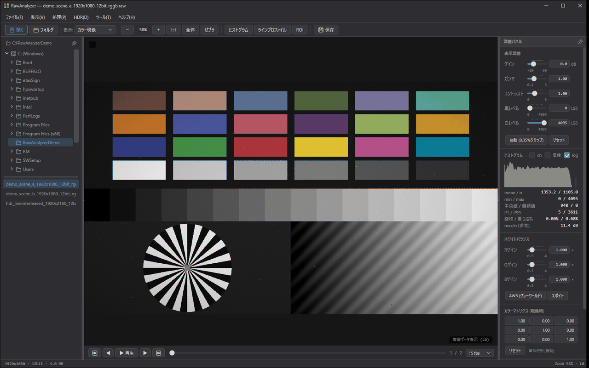
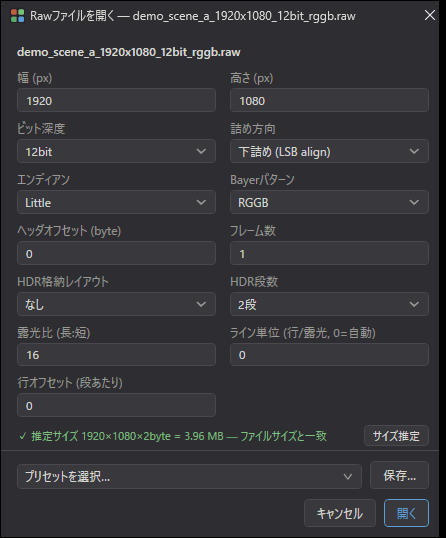
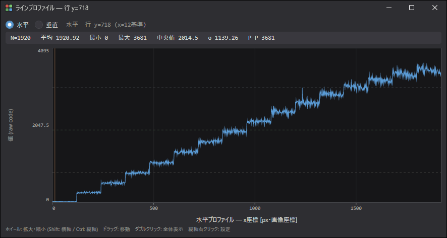
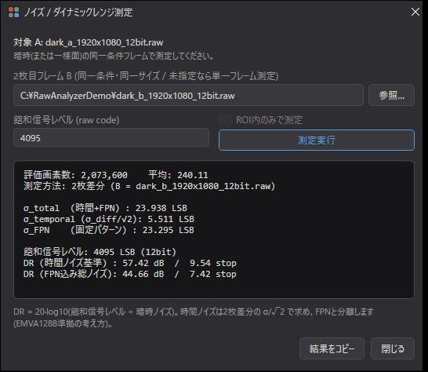
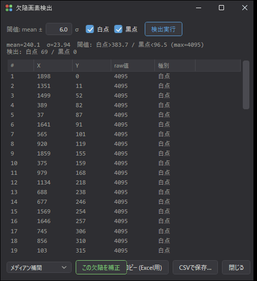
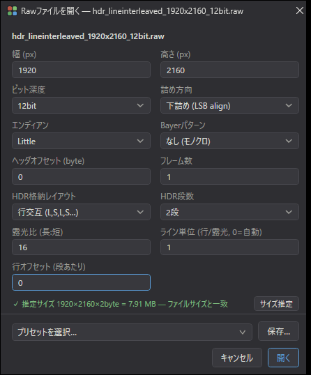
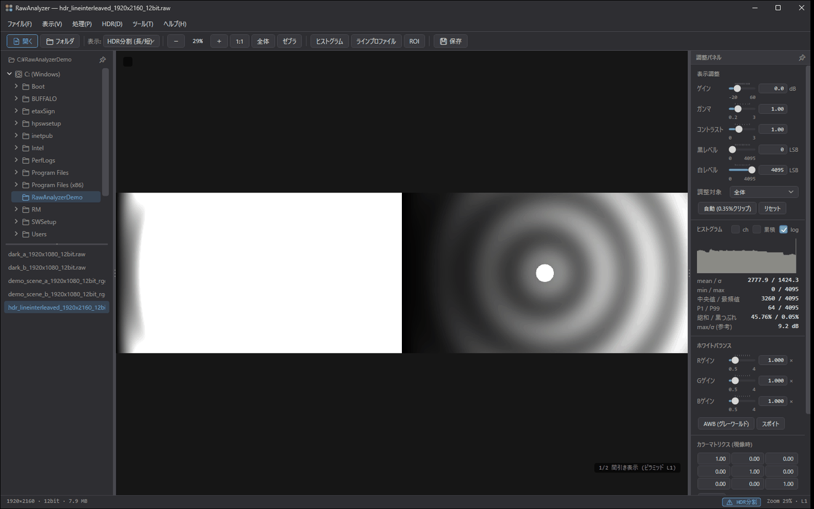
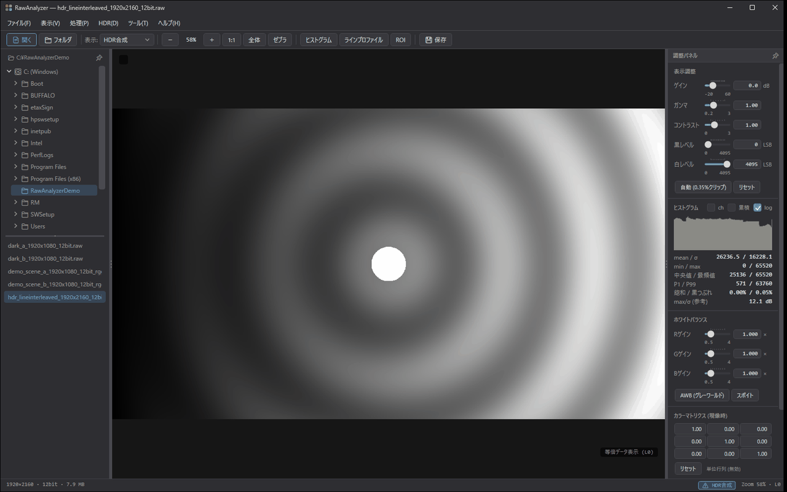
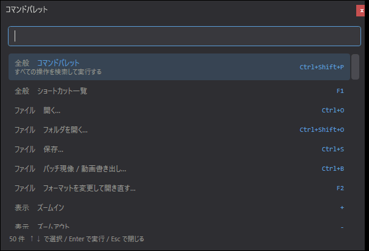
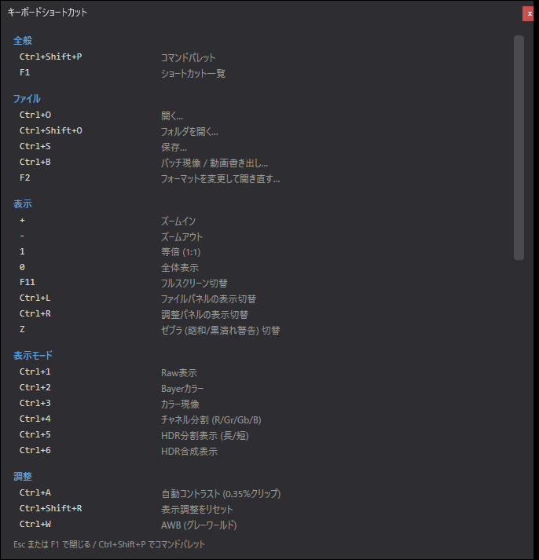

# RawAnalyzer

Raw 画像を表示・分析するための Windows デスクトップアプリです。



- 任意フォーマットの Raw を、幅・高さ・ビット深度・詰め方向・エンディアン・
  ヘッダオフセットを指定して直接開く
- ノイズ / ダイナミックレンジ、欠陥画素、Bayer チャネル別統計、ラインプロファイルを測る
- ライン交互 HDR を分割表示・合成する

.NET 8 / WPF 製。**外部パッケージへの依存はありません**。

---

## ダウンロード

**[→ 最新版をダウンロード](https://github.com/ToshikiTsuboi/RawAnalyzer/releases/latest)**

`RawAnalyzer-<version>-win-x64.zip` を展開して `RawAnalyzer.App.exe` を実行してください。
インストール作業も .NET ランタイムの導入も不要です(自己完結ビルド)。

- 対応: Windows 10 / 11 (64bit)
- 設定は `%AppData%\RawAnalyzer` に保存されます。アンインストールはフォルダごと削除するだけです

> 署名していない実行ファイルのため、初回起動時に SmartScreen の警告が出ることがあります。
> 「詳細情報」→「実行」で起動できます。

---

## 使い方

### 1. Raw を開く

Raw ファイルにはヘッダがないので、開くときに並びを教える必要があります。
`Ctrl+O`、ツールバーの「開く」、またはファイルをドラッグ&ドロップすると設定画面が出ます。



| 項目 | 内容 |
|---|---|
| 幅 / 高さ | 画素数。ファイル名に `1920x1080` のような表記があれば自動で拾います |
| ビット深度 | 8 / 10 / 12 / 14 / 16 bit |
| 詰め方向 | 下詰め (LSB align) / 上詰め (MSB align) |
| エンディアン | Little / Big |
| Bayer パターン | RGGB / BGGR / GRBG / GBRG / なし (モノクロ) |
| ヘッダオフセット | 先頭に読み飛ばすバイト数 |
| フレーム数 | 1 ファイルに複数フレームが連結されている場合 |

下部の**推定サイズ表示**が実ファイルサイズと一致していれば、ひとまず並びは合っています。
分からないときは「サイズ推定」を押すと、ファイルサイズから成立する解像度の候補が出ます。

同じ設定を繰り返し使うなら「保存…」で**プリセット**にできます。
一度開いたファイルの設定は記憶され、次回からは設定画面なしで開きます
(`F2` でいつでも開き直せます)。

> JPEG / PNG / TIFF / BMP はそのままドラッグ&ドロップで開けます。設定画面は出ません。

左下のファイル一覧は、その上の入力欄で絞り込めます(`Ctrl+F` で入力欄へ移動)。
`*.raw` のような拡張子はドロップダウンから選べ、`dark*` や `img_00?.raw` のワイルドカード、
`*.raw *.tif` のように空白や `;` で区切った複数条件(いずれかに一致)も使えます。
`/^img_\d{3}\.raw$/` のように `/` で囲むと正規表現として扱います。大文字小文字は区別しません。

### 2. 見え方を整える

右の調整パネルで表示だけを変えます。**画素データは書き換わりません**。

- **`Ctrl+A` 自動コントラスト** — 上下 0.35% をクリップして黒/白レベルを合わせます。まずこれ
- **ゲイン (dB)** — −20〜+60 dB (×0.1〜×1000)。暗部を持ち上げて確認するとき
- **ガンマ / コントラスト / 黒レベル / 白レベル**
- **`Z` ゼブラ** — 飽和と黒つぶれを縞模様で警告します

表示モードは `Ctrl+1`〜`Ctrl+6` で切り替えます。

| キー | モード | 用途 |
|---|---|---|
| `Ctrl+1` | Raw 表示 | 画素値そのままのグレー表示 |
| `Ctrl+2` | Bayer カラー | デモザイクなしの簡易カラー |
| `Ctrl+3` | カラー現像 | デモザイク + WB + カラーマトリクス |
| `Ctrl+4` | チャネル分割 | R / Gr / Gb / B を 2×2 に並べる |
| `Ctrl+5` / `Ctrl+6` | HDR 分割 / HDR 合成 | 後述 |

拡大すると画素値がそのまま重ねて表示されます。
`Ctrl+矢印` で画素カーソルを 1 画素ずつ動かすと、値をステータスバーで追えます。

### 3. 分布と断面を見る

右パネルには常にヒストグラムと統計が出ています
(mean, σ, min/max, 中央値, 最頻値, P1/P99, 飽和率, 黒つぶれ率)。

- **ROI** — ツールバーの「ROI」で範囲を囲むと、その中だけの統計になります
- **ラインプロファイル** — 「ラインプロファイル」を押して画像上をドラッグすると断面が出ます



水平 / 垂直の切り替え、ROI 内の平均射影(平均・最小・最大・中央値・σ)にも対応します。
縦軸のラベルを右クリックすると「全範囲」「自動 (データに合わせる)」「最小・最大を指定…」から選べます。
数値設定は小さなポップアップで行い、「適用」またはEnterで反映します (raw code単位、小数・負の値も可)。
横軸には画素座標の目盛りと「水平プロファイル — x座標」「垂直プロファイル — y座標」を表示します。
ROI平均射影はROI内の相対番号ではなく、元画像の座標で表示・CSV/TSV出力します。

- グラフ上のホイール: マウス位置を中心に縦横を拡大・縮小。
- Shift＋ホイール: 横軸のみ。Ctrl＋ホイール: 縦軸のみ。各軸の目盛り上でもその軸だけ操作できます。
- 縦軸のホイール拡大は1 raw code幅まで。手動指定やROI平均の自動範囲が1未満の場合は、それ以上拡大せず、縮小は可能です。
- 左ドラッグ: 表示範囲を移動。ダブルクリック、またはグラフの右クリック→「全体表示に戻す」で両軸を全範囲へ戻します。
- 縦軸の手動・ホイール設定は方向やROI射影・計測位置を切り替えても維持します。
  横軸は方向・データ長・ROIの座標が変わると全範囲へ戻します。

拡大・移動は表示だけを変更します。統計値とコピー・CSV/TSVの値は常に選択中のライン/射影全体が対象です。

### 4. ノイズとダイナミックレンジを測る

**ツール → ノイズ / ダイナミックレンジ測定…**

同一条件で撮った暗時フレームを 2 枚用意して、片方を開いた状態でもう片方を指定します。



2 枚差分から σ_temporal = σ(A−B)/√2 を求め、そこから σ_FPN を分離します(EMVA1288 準拠の考え方)。
DR は時間ノイズ基準と FPN 込みの両方を出します。

> 絵柄のあるフレームで測ると、絵柄の濃淡がそのまま σ_FPN に乗って意味のない値になります。
> 暗時か一様面を使ってください。

### 5. 欠陥画素を調べる

**ツール → 欠陥画素検出…**

mean ± Nσ を外れた画素を全画素走査で拾います。暗時なら白点、フラットなら黒点が出ます。



見つけた欠陥は平均 / メディアン補間でその場で補正でき、
一覧は CSV 保存や Excel への貼り付け用にコピーできます。

### 6. HDR を分割・合成する

長秒と短秒が 1 行おきに入っている Raw(いわゆる DOL / Staggered)を扱えます。
開くときに **HDR 格納レイアウト**を「行交互」にして、露光比を入れます。



`Ctrl+5` の **HDR 分割**で、長秒と短秒を左右に並べて確認します。
下の例では長秒(左)が飽和しきっていて、
短秒(右)にだけリングと中心の高輝度スポットが残っているのが分かります。



`Ctrl+6` の **HDR 合成**で 1 枚にまとめます。長秒の飽和部を短秒 × 露光比で置き換えるので、
同じ画像でもリングが中心まで見えています。



センサによっては読み出しのパイプライン遅延で短秒側が縦にずれて格納されます。
その場合は**行オフセット**を入れて段ごとに整列させてから合成してください。
物理ライン 1 本ごとに長秒/短秒を読むセンサ向けに、
1 露光あたりの連続行数(**ライン単位**)も指定できます。

### 7. デジタルビニングとフィルタ

「処理」メニューから「デジタルビニング…」「画像フィルタ…」を選びます。
コマンドパレットからも検索できます。現在表示中の**1フレーム全体**を処理します
(ROI限定・連番一括処理ではありません)。元ファイルは変更せず、処理後に保存できます。
処理を続けて適用でき、元に戻すにはファイルを開き直します。

- ビニング係数: **2×2 / 3×3 / 4×4 / 8×8**。標準は平均で明るさを維持します。
  加算は最大で係数の二乗倍となり、**正規化した16bit表示値の65535で飽和**します。
  元のビット深度からの階調拡張 (12bit→14bit等) は行いません。
  例えば2×2加算では、12bit素材でも入力平均が約1/4フルスケールを超えると飽和します。
- モノクロは隣接画素、RGBは各成分を独立に集約します。
  Bayer RAWでは**R・Gr・Gb・Bを混ぜず、元のCFA配列を保持**します。
  例: 2×2ビニングは入力4×4中の同じCFA位置の4画素を集約して出力2×2を作ります。
  4×4ビニングでは入力8×8から出力2×2を作ります。
- 完全なブロックを作れない右端・下端は除外します。出力寸法と除外量を実行前に表示します。
- フィルタ: 平均化、ガウシアン、メディアン、アンシャープマスク、Sobelエッジ、最小値・最大値。
  窓は3×3〜9×9 (Sobelは3×3固定)、ガウシアンσとアンシャープ強度を指定できます。
  Bayerでは2画素刻みの同色格子上で処理し、RGBは成分ごとに処理します。
  境界は同色の端画素を複製します。Sobelは勾配の大きさを1/4倍して出力します。

結果は小数相当の精度を残すため**正規化16bit**で保持します。例えば12bit RAWのコード100は
内部値1600になり、処理結果の16bit表示では1600が基準です。表示の明るさは維持されます。
RGBはPNG/TIFF/JPEGでカラー保存でき、raw保存は輝度のみです。
元データの色空間の値を直接処理し、ガンマの逆変換は行いません。

処理結果は1億画素以下、出力と作業バッファは合計1GiB以下です (入力画像のメモリは別途必要)。
処理中はキャンセルでき、途中の結果は適用されません。
比較モード・HDR表示は対象外です。HDR素材は露光ごとに分割し、単独の画像として開いてください。

### 8. 複数ページTIFF (仮想スタック)

1つの `.tif` / `.tiff` に複数のページが入った画像を、そのまま開けます。
下部のフレーム送り・スライダー・再生でページを移動し、タイトルとページ表示で現在位置を確認できます。
全ページの画素を一括でメモリへ展開せず、**表示するページを必要時に読み込む**方式です。
切り替え中は直前のページを表示し、読込失敗時も元の表示を維持します。

ファイル連番の再生・送りで到達した多ページTIFFは先頭ページだけを表示し、その後もファイル連番を維持します。
TIFF内のページを送りたい場合は、そのファイルを明示的に開き直してください。

- クラシックTIFFとBigTIFFのメインIFDチェーンに対応 (最大10万ページ)。
  8/16bitのグレースケールとRGB、非圧縮・LZW・ZIP圧縮を検証しています。
  縮小画像 (NewSubfileType=1 のサムネイル・ピラミッド) はページに数えません。
  ImageJ が 4GB 超のスタックに使う「IFD 1つ＋画素連続」形式 (`images=N`) も N ページとして開けます。
  ページごとに寸法・ビット深度・カラー/グレーが異なっても読めます。
  指定したBayer配列はスタック内で保持し、RGBページを挟んでも次のグレーページに適用します (RGBページ自体には適用しません)。
- 非圧縮16bitグレーでストリップが連続配置の場合、既存の大画像用オンデマンド読み出しを使います。
  その他は選択ページをWICでデコードします (1ページ2億画素・推定展開1.5GB以下)。
- 統計・ビニング・フィルタ・通常の保存は**現在の1ページ**が対象です。
  加工後はページ送りを解除します。元のスタックへ戻るにはファイルを開き直してください。
- 通常保存の初期名は `名前_p0001.tif` のようにページ番号付きです。
  スタック全体を失わないよう、現在の1ページによる元TIFFへの直接上書きは禁止しています。
- `Ctrl+B` ではスタック全ページを連番静止画、または1本の動画へ書き出せます。
  動画は全ページが同じ寸法である必要があります。複数ページTIFFへの再保存は未対応です。

OMEのZ/T/C軸は解釈せず IFD 順のページとして扱います。SubIFD はDNG本体の検出にだけ使い、
ピラミッドの縮小画像は開きません。比較モードでは先頭ページだけを表示し、
ファイル名に `TIFFページ 1/N` を表示します。

### 9. 32bit TIFF (実数・整数)

1サンプル32bitのTIFFを開けます。32bit実数 (SampleFormat=3)、
32bit符号なし整数、32bit符号あり整数のグレーとRGB、および16bit実数 (半精度) が対象です。
非圧縮・LZW・ZIP圧縮のいずれでも読めます (16bit実数のRGBと、3サンプル以上など WIC が読めない32bitの多チャネルのグレーは非圧縮のみ)。

内部表現は16bitなので、**値域を調べてから16bitコードへ写します**。
適用した対応関係は画像情報欄に表示し、1コードが表す元の値も添えます。

| 元データ | 対応 | 情報欄の表示例 |
| --- | --- | --- |
| 最大値が1以下 | 0〜1を0〜65535へ (実数TIFFの慣習) | `32bit実数 0〜1 → 16bit` |
| 最大値が1超 | 0〜最大値を0〜65535へ | `32bit値 0〜4095.5 → 16bit (1code≈0.0625)` |
| 負値を含む | 最小〜最大を0〜65535へ | `32bit値 -499.5〜3595.5 → 16bit (1code≈0.0625)` |

- 暗電流減算後などの負のすそは、切り捨てるとノイズ評価が狂うため下端へ寄せて残します。
  このときコード0は0ではなく最小値を指します。表示された`1code`の値で元の値へ戻せます。
- NaN・無限大はコード0にし、その画素数を情報欄に出します。
- 対応関係は**ページ・ファイルごとに決まります**。値域の違うページを送ると換算も変わるため、
  絶対値で比較する場合は情報欄の表示を確認してください。
- カラーはRGBの3成分をまとめた値域で写すので、チャネル間の比は保たれます。アルファは捨てます。

WICはこれらのページのサンプル形式を正しく返しません
(32bit整数も実数として、16bit実数も整数として、ビット列のまま渡してきます)。
本アプリはTIFFのSampleFormatタグを自分で読んで解釈するため、
整数値が極端に小さい実数に化けたり、半精度の1.0が15360という整数になったりしません。
16bit実数のRGBはWICが0〜1へ切り詰めてガンマ変換した整数にしてしまい元の値に戻せないため、
非圧縮のページを自前で読みます (圧縮されたものは理由付きのエラーにします)。

### 10. TIFF の対応範囲と自前復号

センサ評価では「黙って間違った値になる」ことが最も危険なので、TIFF は開く前にヘッダを自前で読み、
形式ごとに経路を決めます。

| 形式 | 経路 |
| --- | --- |
| 非圧縮 16bit グレー / CFA、ストリップ連続 | オンデマンド読み出し (巨大画像向け、メモリに展開しない) |
| 非圧縮 8〜64bit グレー / CFA (10/12/14bit 詰め込み、24bit、64bit、符号あり、実数、タイル、BigTIFF、ImageJ 連続スタック)、WIC が読めない多チャネルのグレー、非圧縮の16bit実数・16bit符号あり整数・24bit・64bit の RGB (BigTIFF・SubIFD では 8/16bit 符号なし整数以外の RGB) | 自前で復号 |
| 圧縮 (LZW / ZIP / PackBits / JPEG / CCITT)、RGB、パレット、CMYK | WIC (Windows Imaging Component) |

- **DNG / CFA**: `.dng` と Photometric=CFA の TIFF は現像せず、生の Bayer 値として開きます。
  CFAPattern から RGGB / BGGR / GRBG / GBRG を自動設定します (LinearRaw はモノクロ扱い)。
  IFD0 がサムネイルで本体が SubIFD にある一般的な DNG も本体を開きます。
  可逆 JPEG 圧縮の DNG と、3 サンプルの LinearRaw (linear DNG) は未対応です (非圧縮で 1 サンプル/画素の CFA / LinearRaw のみ)。
- **ビット深度**: 10/12/14bit 詰め込みはそのビット深度の画像として開きます (白点は 2^N−1)。
  24bit・64bit・符号あり整数・実数は 32bit TIFF と同じく値域から 16bit へ換算し、情報欄に表示します。
  16bit 符号あり整数・24bit・64bit の RGB は WIC が復号できないため非圧縮のみ対応です (圧縮されたものは理由付きのエラーにします)。
  読めない圧縮ページのエラーには、同じ構成の非圧縮ページを実際に開ける場合だけ「非圧縮であれば読めます」と添えます。
- **WhiteIsZero** (Photometric=0) は白黒を反転して開きます。整数は 最大値−値 (符号ありは −1−値)、
  実数は 1−値 とし、サンプル形式・幅によらず同じ向きにそろえます。
  16bit 実数と 32bit 整数の WhiteIsZero は非圧縮のみ対応です (WIC の反転では値が壊れるため)。
- **グレー＋アルファ / 多チャネルのグレー**: 先頭チャネルだけをグレーとして開きます (カラー扱いにしません)。
  値域の換算と WhiteIsZero の反転は 1 サンプルのグレーと同じで、残りのチャネルは値域に入れません。
  WIC が読めない構成 (32bit の 3 サンプル以上と、追加サンプルが未指定 (ExtraSamples=0) の 2 サンプル、
  24/64bit、ExtraSamples 付きまたは WhiteIsZero の 8bit 3 サンプル) は、非圧縮なら自前で読み、
  圧縮されたものは理由付きのエラーにします。
- **アルファ**: グレー・RGB とも値には使わず捨てます。関連アルファ (ExtraSamples=1。色にアルファを掛けた値で
  保存する形式) もアルファで割り戻さず、ファイルに書かれたサンプル値のまま読みます (16bit は 16bit のまま)。
- **未対応の圧縮** (LZMA / Zstd / WebP / JPEG 2000 / JPEG XL / LERC など) は理由付きのエラーにします。
  WIC はこれらをエラーにせず真っ黒な画像として返すため、渡す前に弾いています。
- **BigTIFF** は非圧縮で自前で復号できる形式のみ対応です (グレー / CFA / 多チャネルのグレーと、
  8/16bit 符号なし整数以外の RGB。WIC は BigTIFF を開けません)。
- 1bit / 2bit / 4bit のグレーは 8bit グレーとして開きます。パレット・CMYK・Lab は WIC の色変換結果を 8bit カラーとして表示します。
  JPEG 圧縮以外の YCbCr (非圧縮・LZW・ZIP など)、32bit サンプルの水平差分予測 (Predictor=2) は未対応です (実数差分 Predictor=3 は読めます)。
- Orientation タグは無視し、回転しません。比較画面のファイル名にも値域換算の説明を表示します。

### 11. 保存・書き出し

`Ctrl+S` で保存します。Raw(詰め方向・エンディアン指定)、16bit TIFF、PNG、JPEG、float raw。

**保存時に適用する処理を個別に選べます**(表示 LUT / WB / マトリクス / デモザイク)。
何を焼き込んだかを記録するサイドカーも出せるので、
後から「これは現像後か生か」で迷わずに済みます。

`Ctrl+B` でフォルダ一括の現像バッチと、連番からの動画書き出し(MJPEG AVI / MP4)ができます。
表示調整(黒/白点・ゲイン・ガンマ・コントラスト)を焼き込むかどうかも選べます。
MP4 は Windows 標準の H.264 エンコーダ(Media Foundation)を使います。

### 12. 比較画面を広く使う

「表示」→「比較モード」で最大4枚を比較できます。
追加用の空きペインは表示せず、開いている画像だけで比較領域全体を使います。
1枚は全面、2枚は左右2分割、3枚は横3分割、4枚は2×2です。

- 上部の「＋ 画像を追加」、または比較領域へのファイルのドロップで追加できます。
  ドロップは複数ファイルにも対応します。画像がないときだけ中央にも追加案内を表示します。
- 各ペインの「✕」で閉じると、残りの画像で表示領域を再分配します。
  4枚表示中は追加ボタンが無効になり、1枚閉じると再び追加できます。
- 比較バーの「全画面 (F11)」で左右パネルなどを隠して比較できます。
  全画面でも追加ボタンは残ります。解除は同じボタン、`F11`、または `Esc` です。
- 視野・等倍の同期、表示条件のリンクなど、既存の比較操作は引き続き利用できます。

### キーボード操作

`Ctrl+Shift+P` で**コマンドパレット**が開きます。全機能をここから検索して実行できます。



`F1` でショートカット一覧が出ます(定義から自動生成しているので実際の割り当てとずれません)。



| キー | 操作 |
|---|---|
| `Ctrl+Shift+P` | コマンドパレット |
| `F1` | ショートカット一覧 |
| `矢印` / `Shift+矢印` | パン(1/8 画面 / 1 画面) |
| `Ctrl+矢印` | 画素カーソルを 1 画素移動(値をステータスバーに表示) |
| `Ctrl+Shift+矢印` | 画素カーソルを 10 画素移動 |
| `Ctrl+Alt+矢印` | 画素カーソルを Bayer 同色で 2 画素移動 |
| `0` / `1` | 全体表示 / 等倍 |
| `Ctrl+1`〜`Ctrl+6` | 表示モード切替 |
| `PageUp` / `PageDown` / `Space` | 前後のフレーム / 再生・停止 |

起動引数にパスを渡すと、そのファイルを直接開きます。

---

## 試してみる

手元に Raw がなくても動作を確認できるように、合成サンプルを生成するスクリプトを用意しています。

```powershell
# 評価用シーン (カラーチャート + グレーウェッジ + シーメンススター + ランプ)
.\tools\Generate-DemoScene.ps1

# ノイズ/DR測定用の暗時フレーム2枚
.\tools\Generate-DemoScene.ps1 -Dark -OutputPath dark_a.raw
.\tools\Generate-DemoScene.ps1 -Dark -PairIndex 1 -OutputPath dark_b.raw

# HDR (行交互) のサンプル
.\tools\Generate-DolSample.ps1
```

生成後にコンソールへ表示される設定値を、そのまま設定画面に入れてください。
このページのスクリーンショットは、すべてこれらの合成画像で撮っています。

---

## 主な機能

### 読み込み

| 対応 | 内容 |
|---|---|
| Raw | 8 / 10 / 12 / 14 / 16 bit、LSB / MSB 詰め、Little / Big エンディアン、ヘッダオフセット、マルチフレーム |
| Bayer | RGGB / BGGR / GRBG / GBRG / モノクロ |
| 画像ファイル | JPEG / PNG / TIFF / BMP (RGB・YCbCr 画素値の表示に対応) |
| TIFFスタック | 複数ページのオンデマンド読込・ページ送り・再生・全ページ書き出し |
| 32bit TIFF | 実数・符号あり/なし整数 (グレー/RGB)・16bit実数。値域から16bitへ換算 |
| DNG / CFA TIFF | 非圧縮の CFA を Bayer raw として開く (CFAPattern から配列を自動設定)、BigTIFF、ImageJ 連続スタック、10/12/14/24/64bit |

ファイルサイズから解像度候補を推定する機能と、フォーマットをプリセットとして
保存する機能があります。一度開いたファイルのフォーマットは記憶され、次回は自動で開きます。
ファイル一覧は拡張子・ワイルドカード・正規表現で絞り込めます。

### 表示

- Raw グレー / Bayer カラー / カラー現像 / チャネル分割 (R, Gr, Gb, B の 2x2 並置)
- ゼブラ表示(飽和・黒つぶれ警告)
- 高倍率で画素値をオーバーレイ表示
- ゲイン・ガンマ・コントラスト・黒/白レベル、ホワイトバランス、カラーマトリクス
- 連番ファイル / マルチフレームの再生(ImageJ のバーチャルスタック相当)

### 測定・解析

- ヒストグラム(log / 累積 / Bayer チャネル別)と統計指標
  - mean, σ, min/max, 中央値, 最頻値, P1/P99, 飽和率, 黒つぶれ率
- ROI 統計、ラインプロファイル、ROI 射影(平均・最小・最大・中央値・σ)
- **ノイズ / ダイナミックレンジ測定**
  - 2 枚差分から σ_temporal = σ(A-B)/√2 と σ_FPN を分離
  - DR を時間ノイズ基準と FPN 込みの両方で算出
- **欠陥画素検出**(mean ± Nσ)と平均 / メディアン補間による補正
- 画像演算(ダーク減算 / フラット補正)
- デジタルビニング(平均 / 加算、2×2〜8×8、Bayer CFA保持・RGB対応)
- 空間フィルタ(平均 / ガウシアン / メディアン / アンシャープ / Sobel / 最小値 / 最大値)

### HDR

ライン交互(長秒行と短秒行が交互)とフレーム連結の両方に対応します。

読み出しのパイプライン遅延で短秒側が縦にずれて格納されるセンサのために、
**行オフセット**を指定して段ごとに整列させてから合成できます。
1 露光あたりの連続行数(**ライン単位**)も指定できるので、物理ライン 1 本ごとに
長秒/短秒を読むセンサにも対応します。

### 出力

- Raw(詰め方向・エンディアン指定)、16bit TIFF、PNG、JPEG、float raw
- **保存時に適用する処理を個別に選択**できます(表示 LUT / WB / マトリクス / デモザイク)。
  何を焼き込んだかを記録するサイドカーも出力できます
- フォルダ一括の現像バッチ、連番からの動画書き出し(MJPEG AVI / MP4(H.264))
- ヒストグラム・プロファイル・欠陥画素リストの CSV / TSV 出力

---

## ビルド

.NET 8 SDK が必要です。

```bash
dotnet build RawAnalyzer.sln
dotnet test RawAnalyzer.sln
```

| プロジェクト | 内容 |
|---|---|
| `RawAnalyzer.Core` | 画像処理・解析。UI 非依存(`System.Windows` を参照しない) |
| `RawAnalyzer.App` | WPF 本体。MVVM は自前実装 |
| `RawAnalyzer.Tests` | xUnit。370+ テスト |

`tools/` に検証用の合成 Raw を生成する PowerShell スクリプトがあります。

---

## 制限事項

- Windows 専用です(WPF および WIC に依存)
- HDR 合成結果の表示・解析は 16bit へ量子化した値に対して行います。
  合成域が 16bit に収まらない構成では情報が落ちるため、
  その量(何 bit 失われるか)を情報バーに表示します。無損失で残す場合は float raw で保存してください
- 3 段 HDR の行オフセットは「段あたり」として累積適用します。
  段ごとに遅延量が異なるセンサには対応していません

---

## ライセンス

[MIT License](LICENSE.md)
